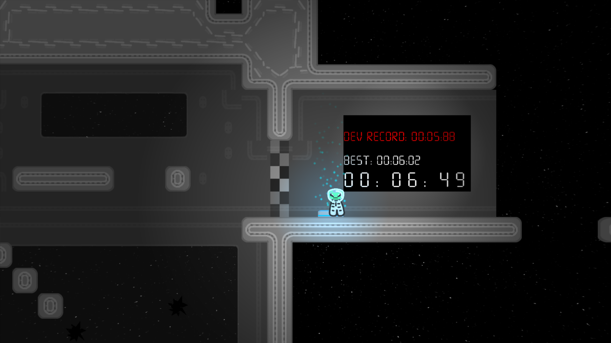
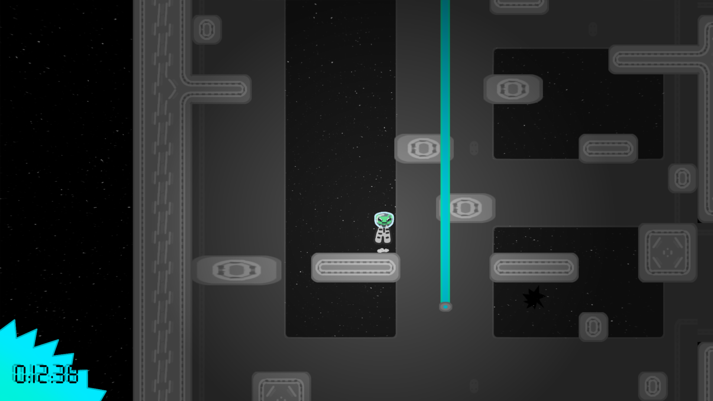

# Alien-game

Alien-game is game that has alien (one alien). This MIGHT be a speedrunning game

~~Notable~~ gameplay features:
 + You can only move by using the mouse
 + Checkpoints
 + Lasers
 + Platforms
 + Timed sections that save your best time and show you the devs (mine) best time
 + No ai used in making (100% human slop)

Note: This game might suck

## Screenshots

### Libraries
+ Arcade
+ Pymunk
+ Pyglet
+ a bunch of default python libs

---

# Building or compiling idk

> Tested only with Python 3.12

## Nuitka
This is what arcade recommends.

1. Install requirements.txt & nuitka
2. compile with `python -m nuitka --standalone --windows-icon-from-ico=icon.ico --windows-console-mode=disable --include-data-dir=./assets=./assets --output-filename=alien-game main.py` (you can also add --onefile, but it might trigger your antivirus)

## PyInstaller
1. Install requirements.txt & pyinstaller
2. compile with `pyinstaller --onefile --noconsole --icon="icon.ico" --name alien-game  main.py`
3. copy the assets folder from to the location of the exe

### You can also just run the game from main.py if you have a python interpreter

---

# Q & A

Q: Game runs bad
: A: womp womp

This concludes the questions and answers section.